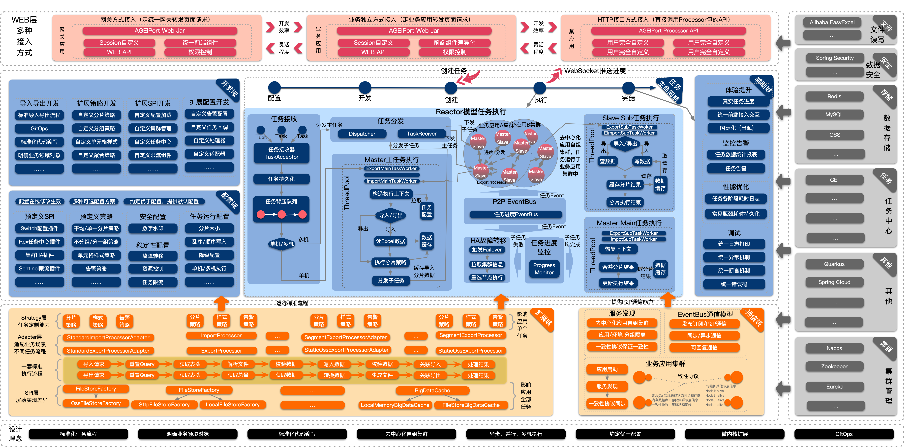

# AGEIPort Alibaba Generic Export Import Framework

[](https://gitter.im/AGEIPort/community?utm_source=badge&utm_medium=badge&utm_campaign=pr-badge)  [](https://github.com/alibaba/AGEIPort/blob/master/LICENSE)

长期招聘，联系邮箱：guijie.rgj@alibaba-inc.com

## 简介

AGEIPort 是数字供应链孵化并在阿里巴巴集团内广泛使用的一套性能卓越、稳定可靠、功能丰富、易于扩展、生态完整的数据导入导出方案，致力于帮助开发者在toB复杂业务场景下能够快速交付高性能、体验优、易维护的数据导入导出功能，如用户页面上的Excel/CSV数据文件上传和下载。目前在阿里巴巴集团内部已有盒马、菜鸟、本地生活、阿里健康、钉钉、淘系等部门有较多使用，并成为多个技术组件的基础底座，经历多次618和双11大促考验，稳定导入导出数据300~400亿条/月。

AGEIPort 基于事件驱动架构设计整体框架，并遵循先进的设计理念：
1. 透明化的集群/单机执行、串行/并行执行，可以大幅提升数据处理性能，开发者只需关注业务逻辑处理。
2. 支持实时任务进度计算和反馈，避免MOCK数据处理进度，提升用户体验。
3. 面向toB复杂业务场景，从多种方式（声明定义、动态定义）、多种维度（配置、插件、策略、SPI）可以满足各种场景的个性需求，可作为平台化、PaaS/SaaS型产品的基础底座。
4. 沉淀多种组件，多种场景、多种功能开箱即用。
5. 秉承GitOps设计理念，将相关的不可变基础设施封装在应用Git仓库内部，可以使交付物更快、更稳定和更安全的发布和回滚。
6. 去中心化架构，业务应用自组集群资源隔离，保证业务功能有较高的隔离性、可伸缩性和可用性。
7. 标准化任务处流程和代码编写，定义出一个数据处理任务的流程与用户需实现的接口，接口间职责分离，标准化用户导入导出代码的编写，提高代码的可维护性。
8. 明确业务领域对象，通过设计泛型接口，明确导入导出代码中的领域模型，可以避免业务代码中大量使用Map、JSON传参，提高代码的可维护性。
9. 记录业务代码执行过程，辅助支持业务代码性能优化

GEI整体架构如图所示



代码层面主要主要分为3个模块

1. ageiport-processor（必须模块），processor模块是框架的核心，对应上图的大部分逻辑。开发者在需要执行数据处理的业务应用中依赖并实现此模块中对应的接口，将业务逻辑编写到接口实现中，任务执行过程中会回调用户实现的接口，向用户的业务代码传输数据执行业务逻辑。processor 模块中包括本地API和HTTPAPI，用户可以在当前或者外部应用调用接口，创建任务实例在processor所在的业务应用创建并执行。
2. ageiport-task（必须模块），task模块是框架任务处理模块，与数据库交互，向processor模块暴露HTTP接口，以支持processor模块任务执行过程中对任务定义和任务实例进行增删改查。开发者需要部署此模块并连接自己的数据库，设置部署此模块的节点网络（如DNS/K8S Service等）保证processor模块网络访问到此task模块的部署节点
3. ageiport-web（可选模块），web模块为前端页面提供的HTTP/Websocket接口（如任务创建、查询、上传文件、下载文件等），减少开发者重复开发Controller代码，对应上图中红色部分。若web模块的功能不符合要求用户可以自行编写Controller代码，调用processor模块的HTTPAPI创建任务实例在processor所在的业务应用创建并执行。后续会开源与web模块配套的前端组件，提高开发者生产效率。

## 基本概念

### 主任务（Main Task）
执行一次导入导出任务，框架会选择一台业务机器作为主任务机器，主任务机器执行GEI框架的代码，执行一些逻辑包括接受本次任务、任务分片，任务分发、任务进度统计、文件合并等工作。
ps：单机模式主任务和子任务在一台机器

### 子任务(Sub Task)
子任务是用户逻辑代码的执行者，每个子任务执行的是整体任务的一部分，举个例子，导出1000条数据，如果分成10个子任务执行，每个子任务只负责自己范围的100条数据的导出。默认的子任务是根据totalCount和sliceSize计算得出切分为几个子任务，子任务分片逻辑可自定义。

### 分片（Slice）
分片顾名思义，就是将一次导入导出的全量数据或条件分成一个个的片段，每个分片是整体的一部分。以导出来说，根据本次导出数据量和配置的分片大小，框架计算总共分多少片，每一片的size和偏移(offset)是多少。

### 偏移（Offset）
框架中偏移的概念用在分片中，举一个例子，一次导出10000条数据，分片大小为1000，则第一个分片的偏移为0，第二个分片的偏移为1000，依次类推。

#### 动态列（Dynamic Column）

很多场景下导入导出文件的数据列是动态变化的，比如7月8日导出的数据列名称是7.8/7.9/7.10，7月9日导出的数据列名称是7.9/7.10/7.11


#### 泛型参数QUERY

QueryObject，映射到查询参数的类，比如查询参数{"name":"tom"}，则QueryObject应包含name字段，前端传递{"name":"tom"}参数时，会构造出一个 name=tom的QueryObject。


#### 泛型参数VIEW

ViewObject，映射到文件中某行数据的类，比如Excel中的每行数据会被构造为这里的一个对象。

#### 泛型参数DATA

DataObject，映射到实际写入数据源或接口的类型，一般是ViewObject执行转换后得到的类型，从文件中读取的数据，很多情况下不能直接插入数据源，需要补齐一些数据，或者添加一些额外的字段，这时候就需要有个补齐或转换操作。如果没有这种需求，V和D可以定义为相同的类型。


## 快速开始

所有示例代码在ageiport-test模块中可见

Maven依赖

```
				<dependency>
            <groupId>com.alibaba</groupId>
            <artifactId>ageiport-processor-core</artifactId>
            <version>0.0.1-SNAPSHOT</version>
            <scope>compile</scope>
        </dependency>
        <dependency>
            <groupId>org.junit.jupiter</groupId>
            <artifactId>junit-jupiter</artifactId>
            <version>5.8.2</version>
            <scope>test</scope>
        </dependency>
           <dependency>
            <groupId>org.projectlombok</groupId>
            <artifactId>lombok</artifactId>
            <version>1.18.22</version>
        </dependency>
```

定义几个导入导出用到的POJO分别对应QUERY/VIEW/DATA三个泛型

```
@ToString
@Getter
@Setter
public class Data {
    private Integer id;
    private String name;
}

```


```
@Getter
@Setter
public class Query {
    private Integer totalCount = 10000;
    private List<View> checkErrorData;
    private List<View> writeErrorData;
}
```

```

@Getter
@Setter
public class View {
    @ViewField(headerName = "编码")
    private Integer id;
    @ViewField(headerName = "姓名")
    private String name;
}

```


### 导出

更多样例及文档说明：[导出样例及文档说明](./docs/zh/导出样例及文档说明.md)

第1步，实现导出Processor

1. 实现ExportProcessor接口，并使用上文定义POJO Query、Data、View作为接口的泛型参数
2. 实现ExportProcessor接口的TotalCount方法，根据Query返回当前导出的总条数（比如根据Query构造Select Count SQL，并返回Count值）
3. 实现ExportProcessor接口的queryData方法，根据Query返回当前分页的实际数据（比如根据Query构造Select ... limit n,m SQL，并返回数据行），如果TotalCount有10000，分片大小默认为1000，则queryData方法会被并行调用10次，入参BizExportPage会携带不同分页信息。
4. 实现ExportProcessor接口的convert方法，根据页面展示规则，把queryData返回的Data列表转为View列表。View列表会最终输出给用户。


```

import com.alibaba.ageiport.common.utils.BeanUtils;
import com.alibaba.ageiport.processor.core.annotation.ExportSpecification;
import com.alibaba.ageiport.processor.core.exception.BizException;
import com.alibaba.ageiport.processor.core.model.api.BizExportPage;
import com.alibaba.ageiport.processor.core.model.api.BizUser;
import com.alibaba.ageiport.processor.core.task.exporter.ExportProcessor;
import com.alibaba.ageiport.test.processor.core.model.Data;
import com.alibaba.ageiport.test.processor.core.model.Query;
import com.alibaba.ageiport.test.processor.core.model.View;

import java.util.ArrayList;
import java.util.List;


//1.实现ExportProcessor接口
@ExportSpecification(code = "StandaloneExportProcessor", name = "StandaloneExportProcessor")
public class StandaloneExportProcessor implements ExportProcessor<Query, Data, View> {

    //2.实现ExportProcessor接口的TotalCount方法
    @Override
    public Integer totalCount(BizUser bizUser, Query query) throws BizException {
        return query.getTotalCount();
    }

    //3.实现ExportProcessor接口的queryData方法
    @Override
    public List<Data> queryData(BizUser user, Query query, BizExportPage bizExportPage) throws BizException {
        List<Data> dataList = new ArrayList<>();

        Integer totalCount = query.getTotalCount();
        for (int i = 1; i <= totalCount; i++) {
            final Data data = new Data();
            data.setId(i);
            data.setName("name" + i);
            dataList.add(data);
        }
        return dataList;
    }

    //4.实现ExportProcessor接口的convert方法
    @Override
    public List<View> convert(BizUser user, Query query, List<Data> data) throws BizException {
        List<View> dataList = new ArrayList<>();
        for (Data datum : data) {
            View view = BeanUtils.cloneProp(datum, View.class);
            dataList.add(view);
        }
        return dataList;
    }
}

```


第2步，注册第1步实现的导出Processor

1. 项目目录的resources文件夹下创建META-INF文件夹
2. META-INF文件夹下创建名为com.alibaba.ageiport.processor.core.Processor的文本文件
3. 添加一行配置记录：StandaloneExportProcessor=com.alibaba.ageiport.test.processor.core.exporter.StandaloneExportProcessor，其中等号左侧为ExportSpecification中的code，等号右侧为导出实现类的全类名

第3步，运行单元测试，执行任务

此步骤实际生产环境中一般由API触发，用户在页面点击触发执行导出任务

1. 初始化AgeiPort实例，在单测中为了尽可能少的依赖外部组件，我们使用AgeiPortOptions.Debug()测试配置来初始化AgeiPort实例。若为生产环境，AgeiPort实例应被维护到应用的上下文中，比如在Spring的Configuration中初始化AgeiPort并作为一个bean存储在Spring上下文中。
2. 构造查询参数TaskExecuteParam，必须传入：TaskSpecificationCode，标识某一个任务）；BizUserId标识当前任务的触发人，上文定义的Query对象需要以JSON的格式传入。
3. 调用本地方法executeTask，开始执行任务，并获取任务实例ID。用户可根据自身技术线路封装远程调用接口。processor包中也包含了可远程执行任务的HTTP API，详情见：API参考文档。
4. 使用内部封装的TaskHelp方法判断任务是否执行成功，TestHelp类主要是封装了一些判断任务执行状态的断言，在后文中给出代码


```

import com.alibaba.ageiport.common.utils.JsonUtil;
import com.alibaba.ageiport.processor.core.AgeiPort;
import com.alibaba.ageiport.processor.core.AgeiPortOptions;
import com.alibaba.ageiport.processor.core.spi.service.TaskExecuteParam;
import com.alibaba.ageiport.processor.core.spi.service.TaskExecuteResult;
import com.alibaba.ageiport.test.processor.core.TestHelper;
import com.alibaba.ageiport.test.processor.core.model.Query;
import lombok.SneakyThrows;
import lombok.extern.slf4j.Slf4j;
import org.junit.jupiter.api.Assertions;
import org.junit.jupiter.api.Test;

@Slf4j
public class StandaloneExportProcessorTest {

    @SneakyThrows
    @Test
    public void test() {
        //1.初始化AgeiPort实例
        AgeiPortOptions options = new AgeiPortOptions();
        AgeiPortOptions.Debug debug = new AgeiPortOptions.Debug();
        options.setDebug(debug);
        AgeiPort ageiPort = AgeiPort.ageiPort(options);

        //2.构造查询参数TaskExecuteParam
        Query query = new Query();
        query.setTotalCount(100);

        //3.调用本地方法executeTask，开始执行任务，并获取任务实例ID。
        TaskExecuteParam request = new TaskExecuteParam();
        request.setTaskSpecificationCode(StandaloneExportProcessor.class.getSimpleName());
        request.setBizUserId("userId");
        request.setBizQuery(JsonUtil.toJsonString(query));
        TaskExecuteResult response = ageiPort.getTaskService().executeTask(request);
        Assertions.assertTrue(response.getSuccess());

        //4.使用内部封装的TaskHelp方法判断任务是否执行成功
        TestHelper testHelper = new TestHelper(ageiPort);
        testHelper.assertWithFile(response.getMainTaskId(), query.getTotalCount());
    }
}
```

第4步，查询任务进度，下载导出文件，见assertWithFile方法

此步骤生产环境中一般由API触发，在用户触发任务后，页面自动轮询任务进度，最终将生成的文件返回给用户，详见API参考文档。

1. 创建进度查询请求参数GetTaskProgressParam，其中MainTaskId为上文创建任务返回的任务ID
2. 调用本地方法，查询任务进度。用户可根据自身技术线路封装远程调用接口。processor包中也包含了可远程执行任务的HTTP API，详情见：API参考文档。
3. 轮询任务进度，直至任务完成或出错
4. 任务完成后，查询任务实例信息，任务输出的文件信息
5. 下载文件到本地
6. 断言判断产生的文件是否符合期望

```

import com.alibaba.ageiport.common.feature.FeatureUtils;
import com.alibaba.ageiport.common.utils.JsonUtil;
import com.alibaba.ageiport.ext.arch.ExtensionLoader;
import com.alibaba.ageiport.processor.core.AgeiPort;
import com.alibaba.ageiport.processor.core.constants.MainTaskFeatureKeys;
import com.alibaba.ageiport.processor.core.model.core.ColumnHeader;
import com.alibaba.ageiport.processor.core.model.core.impl.ColumnHeaderImpl;
import com.alibaba.ageiport.processor.core.model.core.impl.ColumnHeadersImpl;
import com.alibaba.ageiport.processor.core.model.core.impl.MainTask;
import com.alibaba.ageiport.processor.core.spi.file.DataGroup;
import com.alibaba.ageiport.processor.core.spi.file.FileReader;
import com.alibaba.ageiport.processor.core.spi.file.FileReaderFactory;
import com.alibaba.ageiport.processor.core.spi.service.GetTaskProgressParam;
import com.alibaba.ageiport.processor.core.spi.service.TaskProgressResult;
import lombok.extern.slf4j.Slf4j;
import org.junit.jupiter.api.Assertions;

import java.io.File;
import java.io.InputStream;
import java.util.ArrayList;
import java.util.HashMap;
import java.util.List;


@Slf4j
public class TestHelper {

    private AgeiPort ageiPort;

    public TestHelper(AgeiPort ageiPort) {
        this.ageiPort = ageiPort;
    }

    public String file(String fileName) {
        return "." + File.separator + "files" + File.separator + "import-xlsx" + File.separator + fileName;
    }

    public void assertWithoutFile(String mainTaskId) throws InterruptedException {
        GetTaskProgressParam progressRequest = new GetTaskProgressParam();
        progressRequest.setMainTaskId(mainTaskId);
        TaskProgressResult taskProgress = ageiPort.getTaskService().getTaskProgress(progressRequest);
        int sleepTime = 0;
        log.info("getTaskProgress, taskProgress:{}", taskProgress);
        while (taskProgress == null || !taskProgress.getIsFinished() && !taskProgress.getIsError()) {
            Thread.sleep(1000);
            if (sleepTime++ > 100) {
                Assertions.assertTrue(taskProgress.getIsFinished() || taskProgress.getIsError());
            }
            taskProgress = ageiPort.getTaskService().getTaskProgress(progressRequest);
            if (taskProgress != null) {
                log.info("getTaskProgress, percent:{}, stageName:{}", taskProgress.getPercent(), taskProgress.getStageName());
            } else {
                log.info("no progress...");
            }
        }
        Assertions.assertTrue(taskProgress.getIsFinished());
        Assertions.assertEquals(1, taskProgress.getPercent());
    }

    public void assertWithFile(String mainTaskId, Integer outputCount) throws InterruptedException {
        //1.创建进度查询请求参数GetTaskProgressParam
        GetTaskProgressParam progressRequest = new GetTaskProgressParam();
        progressRequest.setMainTaskId(mainTaskId);
        //2.调用本地方法，查询任务进度。
        TaskProgressResult taskProgress = ageiPort.getTaskService().getTaskProgress(progressRequest);
        int sleepTime = 0;
        log.info("getTaskProgress, taskProgress:{}", taskProgress);
        //3.轮询任务进度，直至任务完成或出错
        while (taskProgress == null || !taskProgress.getIsFinished() && !taskProgress.getIsError()) {
            Thread.sleep(1000);
            if (sleepTime++ > 100) {
                Assertions.assertTrue(taskProgress.getIsFinished() || taskProgress.getIsError());
            }
            taskProgress = ageiPort.getTaskService().getTaskProgress(progressRequest);
            if (taskProgress != null) {
                log.info("getTaskProgress, percent:{}, stageName:{}", taskProgress.getPercent(), taskProgress.getStageName());
            } else {
                log.info("no progress...");
            }
        }
        Assertions.assertTrue(taskProgress.getIsFinished());
        Assertions.assertEquals(1, taskProgress.getPercent());

        //4.任务完成后，查询任务实例信息，任务输出的文件信息
        MainTask mainTask = ageiPort.getTaskServerClient().getMainTask(taskProgress.getMainTaskId());
        String fileKey = FeatureUtils.getFeature(mainTask.getFeature(), MainTaskFeatureKeys.OUTPUT_FILE_KEY);
        boolean exists = ageiPort.getFileStore().exists(fileKey, new HashMap<>());
        Assertions.assertTrue(exists);

        String runtimeParam = mainTask.getRuntimeParam();
        String fileType = FeatureUtils.getFeature(runtimeParam, MainTaskFeatureKeys.RT_FILE_TYPE_KEY);
        String headersString = FeatureUtils.getFeature(runtimeParam, MainTaskFeatureKeys.RT_COLUMN_HEADERS_KEY);
        List<ColumnHeaderImpl> columnHeaderList = JsonUtil.toArrayObject(headersString, ColumnHeaderImpl.class);
        List<ColumnHeader> columnHeaderList1 = new ArrayList<>(columnHeaderList);
        ColumnHeadersImpl headers = new ColumnHeadersImpl(columnHeaderList1);

        //5.下载文件到本地
        InputStream inputStream = ageiPort.getFileStore().get(fileKey, new HashMap<>());
        String outputFileReaderFactory = ageiPort.getOptions().getFileTypeReaderSpiMappings().get(fileType);
        final FileReaderFactory factory = ExtensionLoader.getExtensionLoader(FileReaderFactory.class).getExtension(outputFileReaderFactory);

        //6.断言判断产生的文件是否符合期望
        FileReader fileReader = factory.create(ageiPort, mainTask, headers);
        fileReader.read(inputStream);
        DataGroup dataGroup = fileReader.finish();
        int count = 0;
        List<DataGroup.Data> data = dataGroup.getData();
        for (DataGroup.Data datum : data) {
            if (datum.getItems() != null) {
                count += datum.getItems().size();
            }
        }
    }
}

```


### 导入

更多样例及文档说明：[导入样例及文档说明](./docs/zh/导入样例及文档说明.md)

第0步，准备导入文件

此步骤在生产环境中不需要，一般导入的文件由用户通过Web页面上传

1. 项目目录的resources文件夹下创建import-xlsx文件夹
2. 在import-xlsx文件夹创建StandaloneImportProcessor.xlsx文件，包含两列编码、姓名（与View中的字段对应）
3. 在StandaloneImportProcessor.xlsx文件添加一些数据


第1步，实现导入Processor

1. 实现ImportProcessor接口，并使用上文定义POJO Query、Data、View作为接口的泛型参数
2. 实现ImportProcessor接口的convertAndCheck方法，此方法负责检查导入的数据，文件中的View对象转为Data对象。返回值BizImportResult<View, Data>，当无错误数据时BizImportResult只设置View即可，若有错误数据则需设置View，View最终会被写到文件中输出给用户。
3. 实现ExportProcessor接口的write方法，此方法负责执行写入业务逻辑。返回值BizImportResult<View, Data>，当无错误数据时BizImportResult只设置View即可，若有错误数据则需设置View，View最终会被写到文件中输出给用户。

```java

import com.alibaba.ageiport.common.logger.Logger;
import com.alibaba.ageiport.common.logger.LoggerFactory;
import com.alibaba.ageiport.common.utils.JsonUtil;
import com.alibaba.ageiport.processor.core.annotation.ImportSpecification;
import com.alibaba.ageiport.processor.core.model.api.BizUser;
import com.alibaba.ageiport.processor.core.task.importer.ImportProcessor;
import com.alibaba.ageiport.processor.core.task.importer.model.BizImportResult;
import com.alibaba.ageiport.processor.core.task.importer.model.BizImportResultImpl;
import com.alibaba.ageiport.test.processor.core.model.Data;
import com.alibaba.ageiport.test.processor.core.model.Query;
import com.alibaba.ageiport.test.processor.core.model.View;

import java.util.ArrayList;
import java.util.List;


//1.实现ImportProcessor接口
@ImportSpecification(code = "StandaloneImportProcessor", name = "StandaloneImportProcessor")
public class StandaloneImportProcessor implements ImportProcessor<Query, Data, View> {

    Logger logger = LoggerFactory.getLogger(StandaloneImportProcessor.class);

    //2.实现ImportProcessor接口的convertAndCheck方法
    @Override
    public BizImportResult<View, Data> convertAndCheck(BizUser user, Query query, List<View> views) {
        BizImportResultImpl<View, Data> result = new BizImportResultImpl<>();

        List<Data> data = new ArrayList<>();
        for (View view : views) {
            Data datum = new Data();
            datum.setId(view.getId());
            datum.setName(view.getName());
            data.add(datum);
        }

        result.setData(data);
        result.setView(query.getCheckErrorData());
        return result;
    }

    //3.实现ExportProcessor接口的write方法，此方法负责执行写入业务逻辑。
    @Override
    public BizImportResult<View, Data> write(BizUser user, Query query, List<Data> data) {
        BizImportResultImpl<View, Data> result = new BizImportResultImpl<>();
        logger.info(JsonUtil.toJsonString(data));
        result.setView(query.getWriteErrorData());
        return result;
    }
}
```

第2步，注册第1步实现的导入Processor

1. 项目目录的resources文件夹下创建META-INF文件夹
2. META-INF文件夹下创建名为com.alibaba.ageiport.processor.core.Processor的文本文件
3. 添加一行配置记录：StandaloneImportProcessor=com.alibaba.ageiport.test.processor.core.importer.StandaloneImportProcessor，其中等号左侧为ImportSpecification中的code，等号右侧为导出实现类的全类名

第3步，运行单元测试，执行任务

此步骤实际生产环境中一般由API触发，是用户从页面点击导入按钮上传文件触发的。

1. 初始化AgeiPort实例，在单测中为了尽可能少的依赖外部组件，我们使用AgeiPortOptions.Debug()测试配置来初始化AgeiPort实例。若为生产环境，AgeiPort实例应被维护到应用的上下文中，比如在Spring的Configuration中初始化AgeiPort并作为一个bean存储在Spring上下文中。
2. 读取文件并将文件上传到文件存储中，获取文件的Key。
3. 构造查询参数TaskExecuteParam，必须传入：TaskSpecificationCode，标识某一个任务；BizUserId标识当前任务的触发人；InputFileKey为第2步中获取到的文件Key；上文定义的Query对象需要以JSON的格式传入。
4. 调用本地方法executeTask，开始执行任务，并获取任务实例ID。用户可根据自身技术线路封装远程调用接口。processor包中也包含了可远程执行任务的HTTP API，详情见：API参考文档。
5. 使用内部封装的TaskHelp方法判断任务是否执行成功，TestHelp类主要是封装了一些判断任务执行状态的断言，在后文中给出代码

```

import com.alibaba.ageiport.common.collections.Lists;
import com.alibaba.ageiport.common.utils.JsonUtil;
import com.alibaba.ageiport.processor.core.AgeiPort;
import com.alibaba.ageiport.processor.core.AgeiPortOptions;
import com.alibaba.ageiport.processor.core.spi.service.TaskExecuteParam;
import com.alibaba.ageiport.processor.core.spi.service.TaskExecuteResult;
import com.alibaba.ageiport.test.processor.core.TestHelper;
import com.alibaba.ageiport.test.processor.core.model.Query;
import com.alibaba.ageiport.test.processor.core.model.View;
import lombok.SneakyThrows;
import lombok.extern.slf4j.Slf4j;
import org.junit.jupiter.api.Assertions;
import org.junit.jupiter.api.Test;

import java.io.InputStream;
import java.util.HashMap;
import java.util.UUID;

@Slf4j
public class StandaloneImportProcessorTest {

    //本例运行不会返回错误数据
    @SneakyThrows
    @Test
    public void test() {
        //1.初始化AgeiPort实例
        AgeiPortOptions options = new AgeiPortOptions();
        AgeiPortOptions.Debug debug = new AgeiPortOptions.Debug();
        options.setDebug(debug);
        AgeiPort ageiPort = AgeiPort.ageiPort(options);

        //2.读取文件，并上传到文件存储中
        String taskCode = StandaloneImportProcessor.class.getSimpleName();
        TestHelper testHelper = new TestHelper(ageiPort);
        String filePath = testHelper.file(taskCode + ".xlsx");
        InputStream inputStream = this.getClass().getClassLoader().getResourceAsStream(filePath);
        String fileKey = UUID.randomUUID().toString();
        ageiPort.getFileStore().save(fileKey, inputStream, new HashMap<>());

        //3.构造查询参数TaskExecuteParam
        TaskExecuteParam request = new TaskExecuteParam();
        Query query = new Query();
        query.setTotalCount(100);
        request.setTaskSpecificationCode(taskCode);
        request.setBizUserId("userId");
        request.setBizQuery(JsonUtil.toJsonString(query));
        request.setInputFileKey(fileKey);

        //4.调用本地方法executeTask，开始执行任务，并获取任务实例ID
        TaskExecuteResult response = ageiPort.getTaskService().executeTask(request);

        //5.使用内部封装的TaskHelp方法判断任务是否执行成功
        Assertions.assertTrue(response.getSuccess());
        testHelper.assertWithoutFile(response.getMainTaskId());
    }

    //本例运行会返回错误数据
    @SneakyThrows
    @Test
    public void testHasCheckError() {
        //1.初始化AgeiPort实例
        AgeiPortOptions options = new AgeiPortOptions();
        AgeiPortOptions.Debug debug = new AgeiPortOptions.Debug();
        options.setDebug(debug);
        AgeiPort ageiPort = AgeiPort.ageiPort(options);

        //2.读取文件，并上传到文件存储中
        String taskCode = StandaloneImportProcessor.class.getSimpleName();
        TestHelper testHelper = new TestHelper(ageiPort);
        String filePath = testHelper.file(taskCode + ".xlsx");
        InputStream inputStream = this.getClass().getClassLoader().getResourceAsStream(filePath);
        String fileKey = UUID.randomUUID().toString();
        ageiPort.getFileStore().save(fileKey, inputStream, new HashMap<>());

        //3.构造查询参数TaskExecuteParam
        TaskExecuteParam request = new TaskExecuteParam();
        Query query = new Query();
        View view = new View();
        view.setId(1);
        view.setName("name1");
        query.setCheckErrorData(Lists.newArrayList(view));
        query.setTotalCount(100);
        request.setTaskSpecificationCode(taskCode);
        request.setBizUserId("userId");
        request.setBizQuery(JsonUtil.toJsonString(query));
        request.setInputFileKey(fileKey);
        
        //4.调用本地方法executeTask，开始执行任务，并获取任务实例ID
        TaskExecuteResult response = ageiPort.getTaskService().executeTask(request);

        //5.使用内部封装的TaskHelp方法判断任务是否执行成功
        Assertions.assertTrue(response.getSuccess());
        testHelper.assertWithFile(response.getMainTaskId(), query.getErrorCount());
    }
}
```


第4步，查询任务进度，下载导出文件，见assertWithFile方法

此步骤生产环境中一般由API触发，在用户触发任务后，页面自动轮询任务进度，最终将生成的文件返回给用户，详见API参考文档。

1. 创建进度查询请求参数GetTaskProgressParam，其中MainTaskId为上文创建任务返回的任务ID
2. 调用本地方法，查询任务进度。用户可根据自身技术线路封装远程调用接口。processor包中也包含了可远程执行任务的HTTP API，详情见：API参考文档。
3. 轮询任务进度，直至任务完成或出错
4. 若convertAndCheck和write方法返回的BizImportResult包含View，View数据会被写入到输出文件中
5. 若导入有错误数据文件输出，下载文件到本地
6. 若已下载错误文件，断言判断错误文件中的数据是否符合预期

```

import com.alibaba.ageiport.common.feature.FeatureUtils;
import com.alibaba.ageiport.common.utils.JsonUtil;
import com.alibaba.ageiport.ext.arch.ExtensionLoader;
import com.alibaba.ageiport.processor.core.AgeiPort;
import com.alibaba.ageiport.processor.core.constants.MainTaskFeatureKeys;
import com.alibaba.ageiport.processor.core.model.core.ColumnHeader;
import com.alibaba.ageiport.processor.core.model.core.impl.ColumnHeaderImpl;
import com.alibaba.ageiport.processor.core.model.core.impl.ColumnHeadersImpl;
import com.alibaba.ageiport.processor.core.model.core.impl.MainTask;
import com.alibaba.ageiport.processor.core.spi.file.DataGroup;
import com.alibaba.ageiport.processor.core.spi.file.FileReader;
import com.alibaba.ageiport.processor.core.spi.file.FileReaderFactory;
import com.alibaba.ageiport.processor.core.spi.service.GetTaskProgressParam;
import com.alibaba.ageiport.processor.core.spi.service.TaskProgressResult;
import lombok.extern.slf4j.Slf4j;
import org.junit.jupiter.api.Assertions;

import java.io.File;
import java.io.InputStream;
import java.util.ArrayList;
import java.util.HashMap;
import java.util.List;


@Slf4j
public class TestHelper {

    private AgeiPort ageiPort;

    public TestHelper(AgeiPort ageiPort) {
        this.ageiPort = ageiPort;
    }

    public String file(String fileName) {
        return "." + File.separator + "files" + File.separator + "import-xlsx" + File.separator + fileName;
    }

    public void assertWithoutFile(String mainTaskId) throws InterruptedException {
        //1.创建进度查询请求参数GetTaskProgressParam
        GetTaskProgressParam progressRequest = new GetTaskProgressParam();
        progressRequest.setMainTaskId(mainTaskId);
        //2.调用本地方法，查询任务进度。
        TaskProgressResult taskProgress = ageiPort.getTaskService().getTaskProgress(progressRequest);
        int sleepTime = 0;
        log.info("getTaskProgress, taskProgress:{}", taskProgress);
        //3.轮询任务进度，直至任务完成或出错
        while (taskProgress == null || !taskProgress.getIsFinished() && !taskProgress.getIsError()) {
            Thread.sleep(1000);
            if (sleepTime++ > 100) {
                Assertions.assertTrue(taskProgress.getIsFinished() || taskProgress.getIsError());
            }
            taskProgress = ageiPort.getTaskService().getTaskProgress(progressRequest);
            if (taskProgress != null) {
                log.info("getTaskProgress, percent:{}, stageName:{}", taskProgress.getPercent(), taskProgress.getStageName());
            } else {
                log.info("no progress...");
            }
        }
        Assertions.assertTrue(taskProgress.getIsFinished());
        Assertions.assertEquals(1, taskProgress.getPercent());
    }

    public void assertWithFile(String mainTaskId, Integer outputCount) throws InterruptedException {
        //1.创建进度查询请求参数GetTaskProgressParam
        GetTaskProgressParam progressRequest = new GetTaskProgressParam();
        progressRequest.setMainTaskId(mainTaskId);
        //2.调用本地方法，查询任务进度。
        TaskProgressResult taskProgress = ageiPort.getTaskService().getTaskProgress(progressRequest);
        int sleepTime = 0;
        log.info("getTaskProgress, taskProgress:{}", taskProgress);
        //3.轮询任务进度，直至任务完成或出错
        while (taskProgress == null || !taskProgress.getIsFinished() && !taskProgress.getIsError()) {
            Thread.sleep(1000);
            if (sleepTime++ > 100) {
                Assertions.assertTrue(taskProgress.getIsFinished() || taskProgress.getIsError());
            }
            taskProgress = ageiPort.getTaskService().getTaskProgress(progressRequest);
            if (taskProgress != null) {
                log.info("getTaskProgress, percent:{}, stageName:{}", taskProgress.getPercent(), taskProgress.getStageName());
            } else {
                log.info("no progress...");
            }
        }
        Assertions.assertTrue(taskProgress.getIsFinished());
        Assertions.assertEquals(1, taskProgress.getPercent());

        //4.任务完成后，查询任务实例信息，任务输出的文件信息
        MainTask mainTask = ageiPort.getTaskServerClient().getMainTask(taskProgress.getMainTaskId());
        String fileKey = FeatureUtils.getFeature(mainTask.getFeature(), MainTaskFeatureKeys.OUTPUT_FILE_KEY);
        boolean exists = ageiPort.getFileStore().exists(fileKey, new HashMap<>());
        Assertions.assertTrue(exists);

        String runtimeParam = mainTask.getRuntimeParam();
        String fileType = FeatureUtils.getFeature(runtimeParam, MainTaskFeatureKeys.RT_FILE_TYPE_KEY);
        String headersString = FeatureUtils.getFeature(runtimeParam, MainTaskFeatureKeys.RT_COLUMN_HEADERS_KEY);
        List<ColumnHeaderImpl> columnHeaderList = JsonUtil.toArrayObject(headersString, ColumnHeaderImpl.class);
        List<ColumnHeader> columnHeaderList1 = new ArrayList<>(columnHeaderList);
        ColumnHeadersImpl headers = new ColumnHeadersImpl(columnHeaderList1);

        //5.下载文件到本地
        InputStream inputStream = ageiPort.getFileStore().get(fileKey, new HashMap<>());
        String outputFileReaderFactory = ageiPort.getOptions().getFileTypeReaderSpiMappings().get(fileType);
        final FileReaderFactory factory = ExtensionLoader.getExtensionLoader(FileReaderFactory.class).getExtension(outputFileReaderFactory);

        //6.断言判断产生的文件是否符合期望
        FileReader fileReader = factory.create(ageiPort, mainTask, headers);
        fileReader.read(inputStream);
        DataGroup dataGroup = fileReader.finish();
        int count = 0;
        List<DataGroup.Data> data = dataGroup.getData();
        for (DataGroup.Data datum : data) {
            if (datum.getItems() != null) {
                count += datum.getItems().size();
            }
        }
    }
}
```


## 更多文档

[API参考文档](./docs/zh/API参考文档.md)
[导入样例及文档说明](./docs/zh/导入样例及文档说明.md)
[导入样例及文档说明](./docs/zh/导入样例及文档说明.md)


## 谁在使用

阿里巴巴：数字供应链、盒马、菜鸟、本地生活、阿里健康、钉钉、淘系、阿里云

## 联系我们

目前钉钉群受到了一些管控策略影响暂无，若有问题优先提交Issue。AGEIPort的研发同学会定期解答问题，紧急问题可联系龄一（guijie.rgj@alibaba-inc.com）

