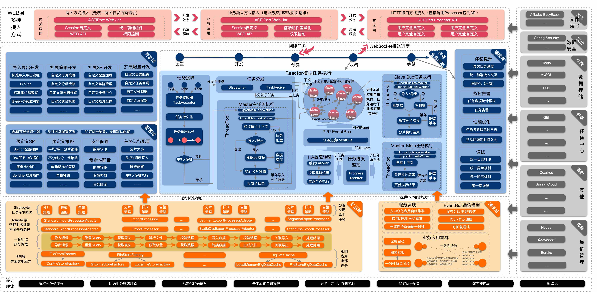

# AGEIPort Alibaba Generic Export Import Framework

  

长期招聘，联系邮箱：guijie.rgj@alibaba-inc.com

## 简介

AGEIPort 是数字供应链孵化并在阿里巴巴集团内广泛使用的一套性能卓越、稳定可靠、功能丰富、易于扩展、生态完整的数据导入导出方案，致力于帮助开发者在toB复杂业务场景下能够快速交付高性能、体验优、易维护的数据导入导出功能，如用户页面上的Excel/CSV数据文件上传和下载。目前在阿里巴巴集团内部已有盒马、菜鸟、本地生活、阿里健康、钉钉、淘系等部门有较多使用，并成为多个技术组件的基础底座，经历多次618和双11大促考验，稳定导入导出数据300~400亿条/月。

AGEIPort 基于事件驱动架构设计整体框架，并遵循先进的设计理念：

1. 透明化的集群/单机执行、串行/并行执行，可以大幅提升数据处理性能，开发者只需关注业务逻辑处理。
2. 支持实时任务进度计算和反馈，避免MOCK数据处理进度，提升用户体验。
3. 面向toB复杂业务场景，从多种方式（声明定义、动态定义）、多种维度（配置、插件、策略、SPI）可以满足各种场景的个性需求，可作为平台化、PaaS/SaaS型产品的基础底座。
4. 沉淀多种组件，多种场景、多种功能开箱即用。
5. 秉承GitOps设计理念，将相关的不可变基础设施封装在应用Git仓库内部，可以使交付物更快、更稳定和更安全的发布和回滚。
6. 去中心化架构，业务应用自组集群资源隔离，保证业务功能有较高的隔离性、可伸缩性和可用性。
7. 标准化任务处流程和代码编写，定义出一个数据处理任务的流程与用户需实现的接口，接口间职责分离，标准化用户导入导出代码的编写，提高代码的可维护性。
8. 明确业务领域对象，通过设计泛型接口，明确导入导出代码中的领域模型，可以避免业务代码中大量使用Map、JSON传参，提高代码的可维护性。
9. 记录业务代码执行过程，辅助支持业务代码性能优化

GEI整体架构如图所示

代码层面主要分为3个模块

1. ageiport-processor（必须模块），processor模块是框架的核心，对应上图的大部分逻辑。开发者在需要执行数据处理的业务应用中依赖并实现此模块中对应的接口，将业务逻辑编写到接口实现中，任务执行过程中会回调用户实现的接口，向用户的业务代码传输数据执行业务逻辑。processor
模块中包括本地API和HTTPAPI，用户可以在当前或者外部应用调用接口，创建任务实例在processor所在的业务应用创建并执行。
2. ageiport-task（必须模块），task模块是框架任务处理模块，与数据库交互，向processor模块暴露HTTP接口，以支持processor模块任务执行过程中对任务定义和任务实例进行增删改查。开发者需要部署此模块并连接自己的数据库，设置部署此模块的节点网络（如DNS/K8S
Service等）保证processor模块网络访问到此task模块的部署节点
3. ageiport-web（可选模块），web模块为前端页面提供的HTTP/Websocket接口（如任务创建、查询、上传文件、下载文件等），减少开发者重复开发Controller代码，对应上图中红色部分。若web模块的功能不符合要求用户可以自行编写Controller代码，调用processor模块的HTTPAPI创建任务实例在processor所在的业务应用创建并执行。后续会开源与web模块配套的前端组件，提高开发者生产效率。

## 基本概念

### 主任务（Main Task）

执行一次导入导出任务，框架会选择一台业务机器作为主任务机器，主任务机器执行GEI框架的代码，执行一些逻辑包括接受本次任务、任务分片，任务分发、任务进度统计、文件合并等工作。
ps：单机模式主任务和子任务在一台机器

### 子任务(Sub Task)

子任务是用户逻辑代码的执行者，每个子任务执行的是整体任务的一部分，举个例子，导出1000条数据，如果分成10个子任务执行，每个子任务只负责自己范围的100条数据的导出。默认的子任务是根据totalCount和sliceSize计算得出切分为几个子任务，子任务分片逻辑可自定义。

### 分片（Slice）

分片顾名思义，就是将一次导入导出的全量数据或条件分成一个个的片段，每个分片是整体的一部分。以导出来说，根据本次导出数据量和配置的分片大小，框架计算总共分多少片，每一片的size和偏移(
offset)是多少。

### 偏移（Offset）

框架中偏移的概念用在分片中，举一个例子，一次导出10000条数据，分片大小为1000，则第一个分片的偏移为0，第二个分片的偏移为1000，依次类推。

### 动态列（Dynamic Column）

很多场景下导入导出文件的数据列是动态变化的，比如7月8日导出的数据列名称是7.8/7.9/7.10，7月9日导出的数据列名称是7.9/7.10/7.11

### 泛型参数QUERY

QueryObject，映射到查询参数的类，比如查询参数{"name":"tom"}，则QueryObject应包含name字段，前端传递{"name":"tom"}参数时，会构造出一个
name=tom的QueryObject。

### 泛型参数VIEW

ViewObject，映射到文件中某行数据的类，比如Excel中的每行数据会被构造为这里的一个对象。

### 泛型参数DATA

DataObject，映射到实际写入数据源或接口的类型，一般是ViewObject执行转换后得到的类型，从文件中读取的数据，很多情况下不能直接插入数据源，需要补齐一些数据，或者添加一些额外的字段，这时候就需要有个补齐或转换操作。如果没有这种需求，V和D可以定义为相同的类型。

## 快速开始

可以直接下载本项目代码，运行 ageiport-test 中的单元测试用例

请注意运行单元测试时框架会将任务存储在本机内存中、将生成的文件存储在本机硬盘中，在部署应用至生产环境时参考"生产环境部署"文档进行相关调整

可参照下列文档，体验框架的更多特性

[API参考文档](./docs/zh/API参考文档.md)

[生产环境部署](./docs/zh/生产环境部署.md)

[导入样例及文档说明](./docs/zh/导入样例及文档说明.md)

[导出样例及文档说明](./docs/zh/导出样例及文档说明.md)

[集群模式任务执行](./docs/zh/集群模式任务执行.md)

## 谁在使用

阿里巴巴：数字供应链、盒马、菜鸟、本地生活、阿里健康、钉钉、淘系、阿里云

## 联系我们

目前钉钉群受到了一些管控策略影响暂无，若有问题优先提交Issue。AGEIPort的研发同学会定期解答问题，紧急问题可联系龄一（guijie.rgj@alibaba-inc.com）

